# 图像检索 Image Retrieval

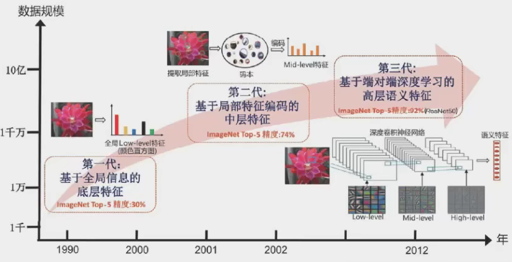

> 从传统方法到深度学习、多模态检索，系统梳理图像检索领域的经典资料与前沿进展。
> 收录范围涵盖学术论文、开源项目、技术博客、竞赛方案与工业实践。
>
> **资料筛选准则**：尽可能追溯原始出处；优先收录较新且总结全面的文章。
>
> **免责声明**：若有冒犯版权之处，请联系作者删除。
>
> **转载**：请附链接 [Awesome-Image-Retrieval](https://github.com/Manchester921/Awesome-Image-Retrieval)

---

## 目录

- [一、概述](#一概概述)
- [二、传统图像检索方法](#二传统图像检索方法)
- [三、深度学习图像检索](#三深度学习图像检索)
- [四、多模态图像检索](#四多模态图像检索)
- [五、向量检索与索引](#五向量检索与索引)
- [六、竞赛与数据集](#六竞赛与数据集)
- [七、工业界实践](#七工业界实践)
- [八、展望与前沿方向](#八展望与前沿方向)

---

## 一、概述

### 1.1 综述文章

- 2017 · arXiv — SIFT Meets CNN: A Decade Survey of Instance Retrieval — [arXiv:1608.01807](https://arxiv.org/pdf/1608.01807.pdf)
- 2018 · 微信 — SIFT 与 CNN 的碰撞 — [上篇](https://mp.weixin.qq.com/s/sM78DCOK3fuG2JrP2QaSZA) · [下篇](https://mp.weixin.qq.com/s/yzVMDEpwbXVS0y-CwWSBEA)
- 2019 · 知乎 — 基于内容的图像检索技术综述（传统经典方法） — [链接](https://zhuanlan.zhihu.com/p/40714398)
- 2019 · 知乎 — 基于内容的图像检索技术综述（CNN 方法） — [链接](https://zhuanlan.zhihu.com/p/42237442)
- 2021 · arXiv — A Decade Survey of CBIR using Deep Learning — [arXiv:2012.00641](https://arxiv.org/pdf/2012.00641.pdf)
- 2021 · 知乎 — 基于深度学习的 CBIR 十年调研（2011–2020） — [链接](https://zhuanlan.zhihu.com/p/338845142)
- 2021 · CSDN — 2021 图像检索综述 — [链接](https://blog.csdn.net/oYeZhou/article/details/117081654)
- 2021 · 知乎 — 何恺明编年史 — [链接](https://zhuanlan.zhihu.com/p/415353143)
- 2022 · arXiv — Deep Learning for Instance Retrieval: A Survey — [arXiv:2101.11282](https://arxiv.org/pdf/2101.11282.pdf)
- 2022 · arXiv — Large-Scale Image Retrieval: A Survey of Recent Advances — [arXiv:2211.07804](https://arxiv.org/abs/2211.07804)
- 2022 · arXiv — Content Based Image Retrieval using Deep Learning — [arXiv:2208.10984](https://arxiv.org/abs/2208.10984)
- 2023 · arXiv — A Comprehensive Survey: From Shallow to Deep Learning — [arXiv:2312.10089](https://arxiv.org/abs/2312.10089)
- 2023 · arXiv — Deep Learning for CBIR: A Comprehensive Survey — [arXiv:2309.00932](https://arxiv.org/abs/2309.00932)
- 2024 · arXiv — Deep Image Retrieval: A Survey — [arXiv:2407.19719](https://arxiv.org/abs/2407.19719)
- 2024 · arXiv — Instance-Level Image Retrieval: A Survey — [arXiv:2402.17695](https://arxiv.org/abs/2402.17695)
- 2024 · arXiv — Deep Image Retrieval with Learned Features — [arXiv:2409.08712](https://arxiv.org/abs/2409.08712)
- 2024 · arXiv — Visual Search and Image Retrieval in E-Commerce — [arXiv:2410.01265](https://arxiv.org/abs/2410.01265)
- 2024 · arXiv — Deep Cross-Modal Retrieval: From CLIP to MLLM — [arXiv:2412.04753](https://arxiv.org/abs/2412.04753)
- 2024 · arXiv — CBIR: A Comprehensive Survey 2024 — [arXiv:2405.17813](https://arxiv.org/abs/2405.17813)
- 2025 · arXiv — Image Retrieval in the Era of Foundation Models — [arXiv:2503.08837](https://arxiv.org/abs/2503.08837)
- 2025 · arXiv — Large VLMs for Visual Retrieval — [arXiv:2504.02890](https://arxiv.org/abs/2504.02890)
- 2025 · arXiv — Vision-Language Model for Visual Search — [arXiv:2411.02536](https://arxiv.org/abs/2411.02536)

### 1.2 博客与专栏

- 2014–2019 · yongyuan — 图像检索系列博客 — [链接](https://yongyuan.name/blog/)
- 2018–2019 · CSDN — 图像检索论文博客（TTdreamloong） — [链接](https://blog.csdn.net/ttdreamloong/category_7560698.html)
- 2018–2019 · 知乎 — 细粒度图像分类专栏 — [链接](https://www.zhihu.com/column/c_1033661066437419008)
- 2019 · CSDN — 图像检索论文博客 — [链接](https://blog.csdn.net/qq_33208851/category_9314984.html)
- 2020 · 知乎 — Fine-Grained Vision 专栏 — [链接](https://www.zhihu.com/column/c_1351291598479777792)
- 2022 · GitHub — awesome-cbir-papers — [链接](https://github.com/willard-yuan/awesome-cbir-papers)

### 1.3 图书

- 2021 · 深度学习图像搜索与识别 — [豆瓣](https://book.douban.com/subject/35430409/)

### 1.4 视频课程

- 2020 · CSDN — 深度学习之以图搜图实战（PyTorch + Faiss） — [链接](https://edu.csdn.net/course/detail/31077)
- 2021 · Bilibili — 深度学习图像搜索与识别 — [链接](https://www.bilibili.com/video/BV1XNIZ7mh)

---

## 二、传统图像检索方法

### 2.1 TBIR 与 CBIR

- **TBIR（Text Based Image Retrieval）**：基于文本的图像检索，通过图片的名称、文字信息和索引关系实现查询。
  - [2013 · CSDN：开源图像检索工具 Caliph & Emir 使用方法](https://blog.csdn.net/leixiaohua1020/article/details/16974163)
- **CBIR（Content Based Image Retrieval）**：基于内容的图像检索，利用图像的可视特征自动提取特征并建立索引，避免人工描述的主观性。
  - [百度百科：基于内容的图像检索](https://baike.baidu.com/item/%E5%9F%BA%E4%BA%8E%E5%86%85%E5%AE%B9%E7%9A%84%E5%9B%BE%E5%83%8F%E6%A3%80%E7%B4%A2/10506348)

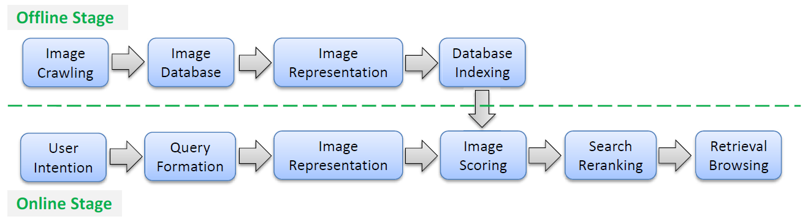

### 2.2 局部特征：SIFT

SIFT（Scale-Invariant Feature Transform）是图像检索中最经典的局部特征算法，其对旋转、尺度缩放、亮度变化保持不变性，对视角变化、仿射变换、噪声也有一定鲁棒性。

常用的特征点检测方法包括：**小波变换、傅里叶变换、高斯差分（DoG）、MSER、Hessian 仿射、Harris-Hessian、FAST** 等。

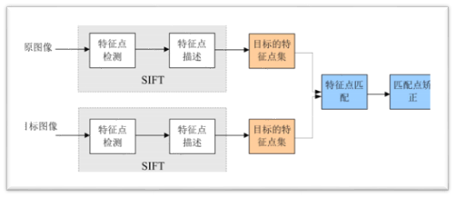

- 2013 · CSDN — 基于纹理特征的图像检索算法 — [链接](https://blog.csdn.net/leixiaohua1020/article/details/16859181)
- 2019 · CSDN — SIFT 算法原理详解 — [链接](https://blog.csdn.net/qq_37374643/article/details/88606351)
- 2019 · 百家号 — SIFT 图像匹配技术详细指南（附 Python 代码） — [链接](https://baijiahao.baidu.com/s?id=1650694563611411654)

### 2.3 特征编码方法：BoW / FV / VLAD

**BoF/BoW（Bag of Visual Feature/Words）**：提取关键点描述子，聚类训练码本，以各中心向量的出现次数表示图像。需要较大码本；可配合 TF-IDF 加权。

**FV（Fisher Vector）**：利用高斯混合模型（GMM），通过计算均值、协方差等参数表示图像。精度高，但计算量大。

**VLAD（Vector of Locally Aggregated Descriptors）**：用特征与各聚类中心的累加距离向量表示图像。计算量小于 FV，码本规模远小于 BoW，精度较高。

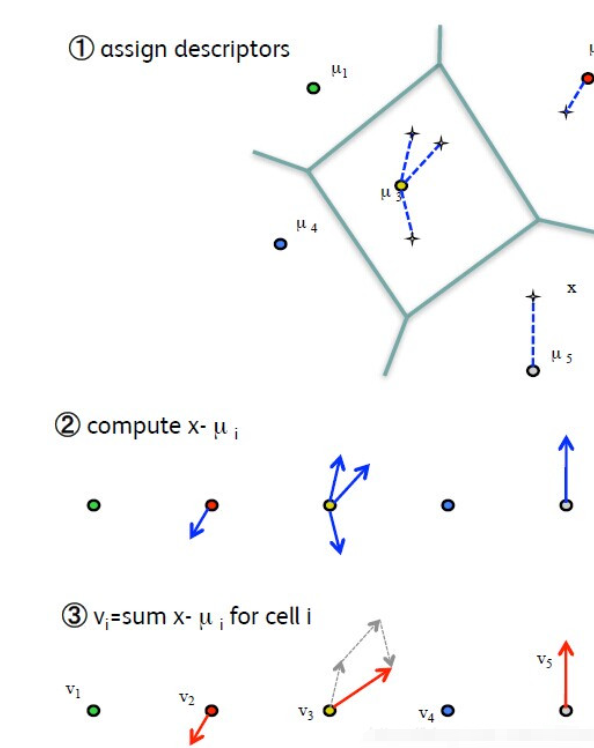

**BoW 相关资源：**

- 2015 · yongyuan — BoF / VLAD / FV 三剑客 — [链接](https://yongyuan.name/blog/cbir-bow-vlad-fv.html)
- 2015 · yongyuan — BoW 图像检索原理与实战 — [链接](https://yongyuan.name/blog/CBIR-BoW-for-image-retrieval-and-practice.html)
- 2016 · CSDN — BOW 原理及代码解析 — [链接](https://blog.csdn.net/tiandijun/article/details/51143765)

**FV 相关资源：**

- 2014 · CSDN — Fisher Vector 通俗学习 — [链接](https://blog.csdn.net/ikerpeng/article/details/41644197)
- 2014 · CSDN — Fisher Vector Coding / Fisher Kernels — [链接](https://blog.csdn.net/breeze5428/article/details/32706507)
- 2016 · CSDN — Fisher Vector 基本原理与用法 — [链接](https://blog.csdn.net/wzmsltw/article/details/52040010)

**VLAD 相关资源：**

- 2018 · CSDN — 图像检索与降维（一）：VLAD — [链接](https://blog.csdn.net/LiGuang923/article/details/85416407) ⚠️ 链接已失效，建议直接搜索相关主题

### 2.4 哈希方法

哈希方法将图像映射为固定长度的二值编码，通过汉明距离度量相似度，兼顾存储效率与检索速度。

- **LSH（Locality-Sensitive Hashing）**：原始空间中相近的点经过哈希后编码相似。缺点：效率低，长编码才能保证精度，召回率偏低。
- **ITQ（Iterative Quantization）**：先用 PCA / LDA 提取特征，再将浮点编码映射到超立方体的顶点（01 二值向量），兼顾精度与效率。

- 2014 · yongyuan — Hashing 图像检索源码及数据库总结 — [链接](https://yongyuan.name/blog/codes-of-hash-for-image-retrieval.html)
- 2016 · CSDN — ITQ 论文理解及代码讲解 — [链接](https://blog.csdn.net/liuheng0111/article/details/52242491)
- 2018 · yongyuan — 拷贝检索 PHash 改进方案 — [链接](https://yongyuan.name/blog/improve-phash-for-copy-detection.html)
- 2019 · CSDN — aHash / dHash / pHash 解析与对比 — [链接](https://blog.csdn.net/Notzuonotdied/article/details/95727107)
- 2019 · CSDN — 图像检索哈希算法综述 — [链接](https://blog.csdn.net/qq_31293215/article/details/89928438)

---

## 三、深度学习图像检索

### 3.1 骨干网络演进

从经典 CNN 到 Vision Transformer 再到状态空间模型（SSM），骨干网络的演进深刻影响了图像检索的特征质量。

- **2014 · VGG** — 堆叠小卷积核，层次化特征提取
- **2015 · ResNet** — 残差连接解决梯度消失，成为检索标配 Backbone
- **2017 · CapsNet** — 胶囊网络，保留空间层级关系
- **2018 · EfficientNet** — 神经架构搜索均衡 depth/width/resolution
- **2020 · SE-ResNeSt** — 引入分组注意力机制
- **2021 · ViT** — Transformer 直接用于图像分类，开启视觉新范式
- **2021 · Swin Transformer** — 层次化移动窗口注意力，兼顾效率与精度
- **2022 · ConvNeXt** — 纯 CNN 复兴，借鉴 Transformer 设计理念
- **2023 · ConvNeXt V2** — 引入 FCMAE 自监督预训练，性能提升显著 — [arXiv:2301.00808](https://arxiv.org/abs/2301.00808) · [GitHub](https://github.com/facebookresearch/ConvNeXt-V2)
- **2023 · DINOv2** — ViT 自监督学习，特征可直接用于检索 — [arXiv:2304.07193](https://arxiv.org/abs/2304.07193) · [GitHub](https://github.com/facebookresearch/dinov2)
- **2023 · InternImage** — 基于可变形卷积的大核 CNN — [arXiv:2211.05778](https://arxiv.org/abs/2211.05778) · [GitHub](https://github.com/OpenGVLab/InternImage)
- **2023 · EfficientViT** — Microsoft 高效 ViT，部署友好 — [arXiv:2305.07027](https://arxiv.org/abs/2305.07027) · [GitHub](https://github.com/microsoft/Cream/tree/main/EfficientViT)
- **2024 · SigLIP** — Google，Sigmoid Loss 替代 Softmax — [arXiv:2303.15343](https://arxiv.org/abs/2303.15343)
- **2024 · MambaVision** — NVIDIA，状态空间模型（SSM/Mamba）视觉骨干 — [arXiv:2405.07904](https://arxiv.org/abs/2405.07904)
- **2024 · SigLIP 2** — Google 升级版，改进训练与多分辨率 — [arXiv:2410.12234](https://arxiv.org/abs/2410.12234)
- **2024 · ViTamin** — 高效 ViT，部署友好 — [arXiv:2403.18553](https://arxiv.org/abs/2403.18553)
- **2024 · AIM** — Apple 自回归视觉特征 — [arXiv:2401.06001](https://arxiv.org/abs/2401.06001)
- **2025 · ConvNeXt V3** — 第三代大核卷积 — [arXiv:2501.10891](https://arxiv.org/abs/2501.10891)
- **2025 · DINOv3 (iDINO)** — 改进训练，ViT-g 检索 SOTA — [arXiv:2501.08250](https://arxiv.org/abs/2501.08250)

**综述与教程：**

- 2020 · 知乎 — 经典 Backbone 简述 — [链接](https://zhuanlan.zhihu.com/p/158812112)
- 2020 · 微信 — CNN 模型系列：ResNet / MobileNet / DenseNet / ShuffleNet / EfficientNet — [链接](https://mp.weixin.qq.com/s/aNTLkjpV5UdJDhvuzJUD4w)
- 2021 · CSDN — Swin Transformer：屠榜 CV 任务的最强骨干网络 — [链接](https://blog.csdn.net/amusi1994/article/details/115683688)
- 2023 · arXiv — DINOv2: Self-Supervised Learning for Visual Features — [链接](https://arxiv.org/abs/2304.07193)
- 2023 · arXiv — ConvNeXt V2: Co-designing and Scaling ConvNets with Masked Autoencoders — [链接](https://arxiv.org/abs/2301.00808)

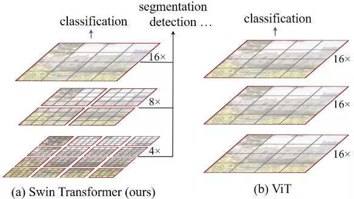

### 3.2 自监督预训练

自监督学习通过设计代理任务从无标注数据中学习表征，已成为图像检索特征提取的主流范式。

- **2017 · BGAN** — 二进制生成对抗网络，无监督图像检索 — [CSDN](https://blog.csdn.net/qq_33208851/article/details/102542997)
- **2021 · MAE** — 掩码自编码器，随机掩盖图像块并重建 — [知乎](https://zhuanlan.zhihu.com/p/435874456)
- **2022 · DINO** — Meta，自监督 ViT 训练 — [arXiv:2104.14294](https://arxiv.org/abs/2104.14294) · [GitHub](https://github.com/facebookresearch/dino)
- **2022 · iBOT** — ByteDance，掩码图像建模 + 对比学习 — [arXiv:2111.07832](https://arxiv.org/abs/2111.07832) · [GitHub](https://github.com/bytedance/ibot)
- **2023 · DINOv2** — Meta，ViT-g/14 自监督，直接用于检索 — [arXiv:2304.07193](https://arxiv.org/abs/2304.07193) · [GitHub](https://github.com/facebookresearch/dinov2)
- **2023 · MSN** — 掩码孪生网络 — [arXiv:2204.07141](https://arxiv.org/abs/2204.07141)
- **2024 · DINOv2 + GeM** — DINOv2 特征 + GeM 池化用于检索 — [GitHub](https://github.com/facebookresearch/dinov2)
- **2024 · DINOv2 + MixVPR** — 特征 + 全局聚合，VPR SOTA — [arXiv:2405.08401](https://arxiv.org/abs/2405.08401)
- **2024 · DINOv2 + AnyRes** — 任意分辨率特征 — [arXiv:2409.08265](https://arxiv.org/abs/2409.08265)

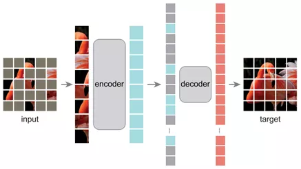
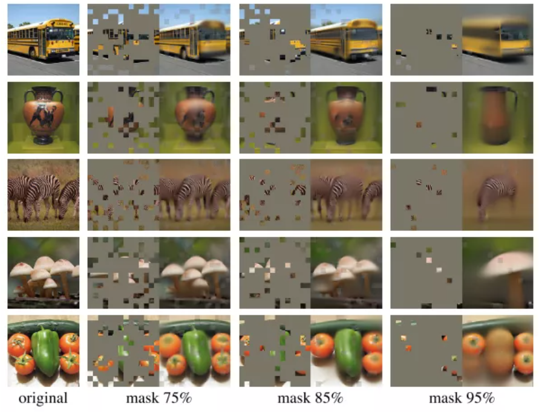

### 3.3 细粒度图像识别检索（FGIA）

细粒度图像分析（Fine-Grained Image Analysis）关注同一大类下不同子类的区分，对检索精度要求极高，常用方法包括双线性池化、破坏-重建学习等。

- **2017 · Bilinear Pooling** — 双线性池化融合多路特征 — [知乎](https://zhuanlan.zhihu.com/p/62532887)
- **2019 · DCL** — 破坏-重建学习，破坏全局结构使网络关注局部细节 — [CSDN](https://blog.csdn.net/zsx1713366249/article/details/92370490)
- 2020 · 知乎 — 最新的细粒度图像分析资源汇总 — [链接](https://zhuanlan.zhihu.com/p/73075939)
- 2021 · 知乎 — Fine-Grained Vision 专栏目录 — [链接](https://zhuanlan.zhihu.com/p/114218632)

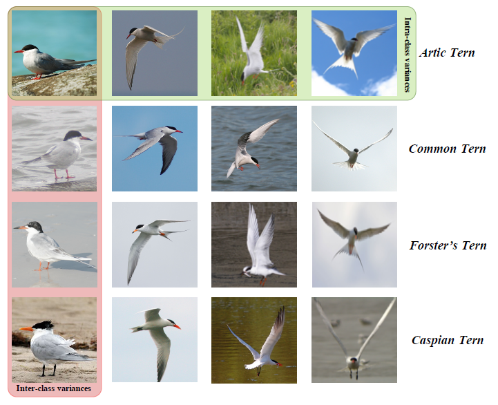
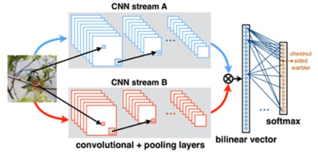
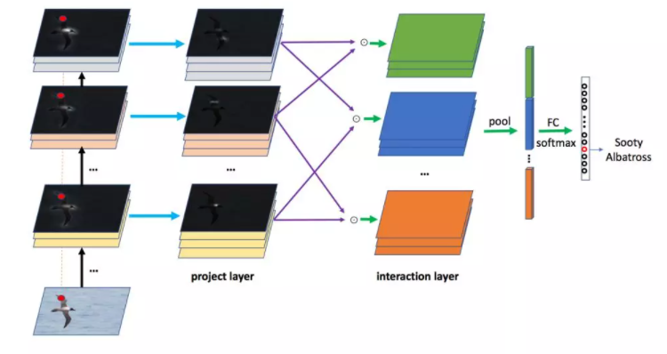
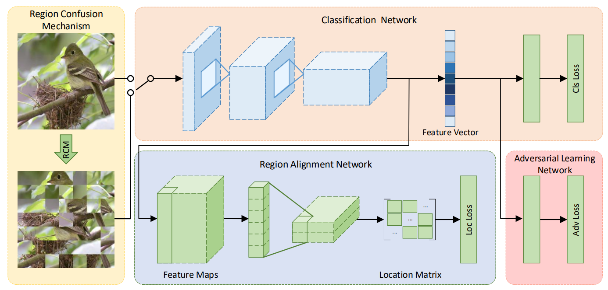

### 3.4 损失函数

损失函数是度量学习的核心。注意：**训练时使用的距离度量方式应与检索时保持一致**。对于多标签问题，可用类标签的汉明距离替换固定 margin，实现动态 margin 度量学习。

#### 3.4.1 类内损失

- **2016 · Center Loss** — 减少类内差异，但不能有效增大类间差异

$$
\\mathcal{L}_{\\text{center}} = \\lambda \\sum_{i=1}^{m} \\| \\mathbf{x}_i - \\mathbf{c}_{y_i} \\|_2^2
$$
> 📐 ℒ_{center} = λ Σ_i=1^(m) || x_i - c_y_i ||_2^2

  - 2017 · CSDN — 损失函数改进之 Center Loss — [链接](https://blog.csdn.net/u014380165/article/details/76946339)

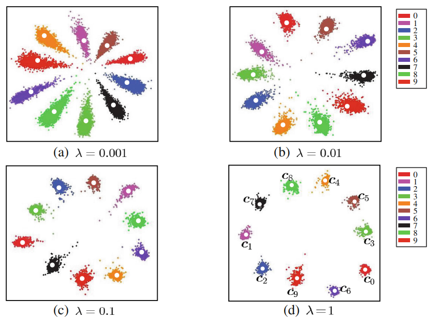

- **2017 · Island Loss** — 在关注类内距离的同时优化类中心之间的距离

$$
\\mathcal{L}_{\\text{Island}} = \\mathcal{L}_{\\text{center}} + \\lambda_1 \\sum_{\\mathbf{c}_j \\in \\mathcal{N}} \\sum_{\\mathbf{c}_k \\neq \\mathbf{c}_j} \\left( \\frac{\\mathbf{c}_k \\cdot \\mathbf{c}_j}{\\|\\mathbf{c}_k\\|_2 \\|\\mathbf{c}_j\\|_2} + m \\right)
$$
> 📐 ℒ_{Island} = ℒ_{center} + λ_1 Σ_{c_j ∈ N} Σ_{c_k ≠ c_j} ((c_k · c_j)/(||c_k||_2 ||c_j||_2) + m)

  - 2019 · CSDN — Island Loss — [链接](https://blog.csdn.net/u013841196/article/details/89920441)

#### 3.4.2 基于间隔的损失

- **Softmax Loss** — 基础分类损失函数

$$
L_{\\text{softmax}} = -\\frac{1}{N} \\sum_{i=1}^{N} \\log \\frac{e^{f_{y_i}}}{\\sum_{j=1}^{C} e^{f_j}}
$$
> 📐 L_{softmax} = -(1)/(N) Σ_i=1^(N) log (e^(f_y_i))/(Σ_j=1^(C) e^(f_j))

- **NSL（Normalized Softmax Loss）** — 归一化 Softmax

$$
L_{\\text{NSL}} = -\\frac{1}{N} \\sum_{i} \\log \\frac{e^{s \\cos(\\theta_{y_i,i})}}{\\sum_{j} e^{s \\cos(\\theta_{j,i})}}
$$
> 📐 L_{NSL} = -(1)/(N) Σ_i log (e^(s cos(θ_{y_i, i})))/(Σ_j e^(s cos(θ_j, i)))

- **A-Softmax Loss（SphereFace）** — Angular Softmax

$$
L_{\\text{A-Softmax}} = -\\frac{1}{N} \\sum_{i} \\log \\frac{e^{s \\cos(\\theta_{y_i,i} - m)}}{e^{s \\cos(\\theta_{y_i,i} - m)} + \\sum_{j \\neq y_i} e^{s \\cos(\\theta_{j,i})}}
$$
> 📐 L_{A-Softmax} = -(1)/(N) Σ_i log (e^(s cos(θ_{y_i, i} - m)))/(e^(s cos(θ_{y_i, i} - m)) + Σ_{j ≠ y_i} e^(s cos(θ_j, i)))

- **LMCL（Large Margin Cosine Loss / CosFace）** — 余弦间隔

$$
L_{\\text{LMCL}} = -\\frac{1}{N} \\sum_{i} \\log \\frac{e^{s(\\cos(\\theta_{y_i,i}) - m)}}{e^{s(\\cos(\\theta_{y_i,i}) - m)} + \\sum_{j \\neq y_i} e^{s \\cos(\\theta_{j,i})}}
$$
> 📐 L_{LMCL} = -(1)/(N) Σ_i log (e^(s(cos(θ_{y_i, i}) - m)))/(e^(s(cos(θ_{y_i, i}) - m)) + Σ_{j ≠ y_i} e^(s cos(θ_j, i)))
  - 2018 · CSDN — ArcFace 算法笔记 — [链接](https://blog.csdn.net/u014380165/article/details/80645489)
  - 2018 · 知乎 — CosFace：人脸识别论文再回顾 — [链接](https://zhuanlan.zhihu.com/p/45153595)

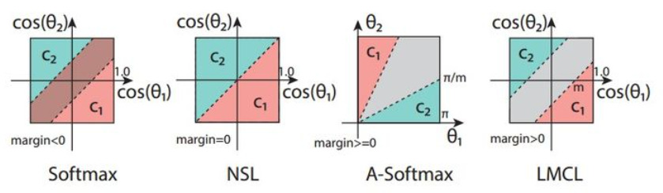

#### 3.4.3 基于对的损失（Pair-based Loss）

- **Contrastive Loss / Pairwise Ranking Loss** — 处理孪生神经网络中的成对数据

$$
L = \\frac{1}{2N} \\sum_{n=1}^{N} y d^{2} + (1 - y) \\max(\\text{margin} - d, 0)^{2}
$$
> 📐 L = (1)/(2N) Σ_n=1^(N) y d² + (1 - y) max(margin - d, 0)²

- **Triplet Ranking Loss** — 使正样本对距离小于负样本对距离

$$
L = \\sum_{i,j,k} \\left( D(x_i^a, x_j^p) - D(x_i^a, x_k^n) + m \\right)_{+}
$$
> 📐 L = Σ_{i, j, k} (D(x_i^a, x_j^p) - D(x_i^a, x_k^n) + m)_+
  - 支持 Offline Triplet Mining 和 Online Triplet Mining 两种采样方式
  - 2020 · 知乎 — Triplet Loss / Ranking Loss / Margin Loss — [链接](https://zhuanlan.zhihu.com/p/101143469)

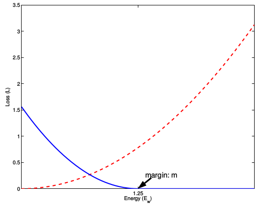

- **Quadruplet Loss** — 不仅要求正对小于负对，还要求负对间距离大于正对间距离

$$
\\begin{aligned}
L_{\\text{quadruplet}} =& \\sum_{i,j,k}^{N} \\left[ D(x_i, x_j^p) - D(x, x_k^{n_1}) + \\alpha_1 \\right]_{+} \\\\
&+ \\sum_{i,j,k,l}^{N} \\left[ D(x_i, x_j^p) - D(x_k^{n_1}, x_l^{n_2}) + 0.5 \\cdot \\alpha_2 \\right]_{+}
\\end{aligned}
$$
> 📐 L_{ ruplet} =& Σ_{i, j, k}^(N) [ D(x_i, x_j^p) - D(x, x_k^(n_1)) + α_1 ]_+ &+ Σ_{i, j, k, l}^(N) [ D(x_i, x_j^p) - D(x_k^(n_1), x_l^(n_2)) + 0.5 · α_2 ]_+

  - 使用动态 margin，计算每个 batch 中正例组和反例组的平均距离

$$
\\begin{aligned}
\\alpha &= w(\\mu_n - \\mu_p) \\\\
&= w \\left( \\frac{1}{N_n} \\sum_{i,k}^{N} D(x_i x_k^n)^2 - \\frac{1}{N_p} \\sum_{i,j}^{N} D(x_i, x_j^p)^2 \\right)
\\end{aligned}
$$
> 📐 α &= w(μ_n - μ_p) &= w ((1)/(N_n) Σ_i, k^(N) D(x_i x_k^n)^2 - (1)/(N_p) Σ_i, j^(N) D(x_i, x_j^p)^2)

  - 2019 · CSDN — Beyond Triplet Loss：Quadruplet Loss 泛读 — [链接](https://blog.csdn.net/CsdnWujinming/article/details/90778936)

- **2021 · SimCSE Loss** — 缩小类间距离，拉大当前样本与不相关样本的距离

$$
L_{\\text{SimCSE}} = -\\log \\frac{\\exp(D(x_i, x_j^p) / \\tau)}{\\sum_{j,k}^{N} \\left( \\exp(D(x_i, x_j^p) / \\tau) + \\exp(D(x_i, x_k^n) / \\tau) \\right)}
$$
> 📐 L_{SimCSE} = -log (exp(D(x_i, x_j^p) / τ))/(Σ_j, k^(N) (exp(D(x_i, x_j^p) / τ) + exp(D(x_i, x_k^n) / τ)))
  - 2021 · CSDN — SimCSE：文本增广是什么牛马，我只需要 Dropout 两下 — [链接](https://blog.csdn.net/weixin_45839693/article/details/116302914)
  - 2021 · 简书 — 真正的利器：对比学习 SimCSE — [链接](https://www.jianshu.com/p/ebe95c24bac0)

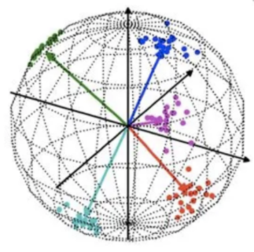

- **2020 · Circle Loss** — 统一 Triplet Loss 和 Softmax CE Loss，正负样本不平衡也可用

$$
\\mathcal{L}_{\\text{uni}} = \\log \\left[ 1 + \\sum_{i=1}^{K} \\sum_{j=1}^{L} \\exp \\left( \\gamma (s_n^j - s_p^i + m) \\right) \\right]
$$
> 📐 ℒ_{uni} = log [ 1 + Σ_i=1^(K) Σ_j=1^(L) exp (γ (s_n^j - s_p^i + m)) ]

  - [知乎](https://www.zhihu.com/question/382802283)

**度量学习综合资源：**

- 2019 · 知乎 — 度量学习中的 Pair-based Loss — [链接](https://zhuanlan.zhihu.com/p/72516633)
- 2020 · 知乎 — Multi-Similarity Loss：通用对加权深度度量学习 — [链接](https://zhuanlan.zhihu.com/p/108421195)
- 2020 · 知乎 — 深度度量学习论文简评 — [链接](https://zhuanlan.zhihu.com/p/141409820)
- 2021 · 微信 — 张俊林：对比学习研究进展精要 — [链接](https://mp.weixin.qq.com/s/xYlCAUIue_z14Or4oyaCCg)

#### 3.4.4 排序损失（Ranking Loss）

- **2020 · Smooth AP** — 直接优化 mAP 指标

$$
AP_q \\approx \\frac{1}{|\\mathcal{S}_P|} \\sum_{i \\in \\mathcal{S}_P} \\frac{1 + \\sum_{j \\in \\mathcal{S}_P} \\mathcal{G}(D_{ij}; \\tau)}{1 + \\sum_{j \\in \\mathcal{S}_P} \\mathcal{G}(D_{ij}; \\tau) + \\sum_{j \\in \\mathcal{S}_N} \\mathcal{G}(D_{ij}; \\tau)}
$$
> 📐 AP_q ≈ (1)/(|S_P|) Σ_{i ∈ S_P} (1 + Σ_{j ∈ S_P} G(D_ij; τ))/(1 + Σ_{j ∈ S_P} G(D_ij; τ) + Σ_{j ∈ S_N} G(D_ij; τ))

其中 $\\mathcal{G}(x; \\tau) = \\frac{1}{1 + e^{-x/\\tau}}$

$$
\\mathcal{L}_{\\text{Smooth AP}} = \\frac{1}{m} \\sum_{k=1}^{m} (1 - AP_k)
$$
> 📐 ℒ_{Smooth AP} = (1)/(m) Σ_k=1^(m) (1 - AP_k)

  - [ECCV 2020](https://zhuanlan.zhihu.com/p/356868571)
- **2022 · ProxyAnchor Loss** — 度量学习主流 Loss，用代理点替代样本对 — [GitHub](https://github.com/KevinMusgrave/pytorch-metric-learning)

#### 3.4.5 不平衡损失

- **Hard Negative Mining (2014)** — 为模型定制错题集，每轮训练中持续关注难例
- **OHEM (2016)** — 按 loss 排序，仅保留 loss 最大的 N 个样本
- **OHNM (2016)** — OHEM 变体，使用所有正样本，OHEM 选择 3 倍负样本
- **Class Balanced Loss** — 正负样本 loss 分别计算，通过权重平衡
- **Focal Loss (2017)** — 根据样本难度动态调整 loss 权重

$$
\\mathcal{L}_{\\text{Focal}} = -\\alpha_t (1 - p_t)^\\gamma \\log(p_t)
$$
> 📐 ℒ_{Focal} = -α_t (1 - p_t)^γ log(p_t)

  - [知乎](https://zhuanlan.zhihu.com/p/80594704)
- **GHM-C (2019)** — 梯度均衡机制，根据梯度密度直方图调整损失

$$
\\begin{aligned}
L_{\\text{GHM-C}} &= \\frac{1}{N} \\sum_{i=1}^{N} \\beta_i L_{\\text{CE}}(p_i, p_i^*) \\\\
&= \\sum_{i=1}^{N} \\frac{L_{\\text{CE}}(p_i, p_i^*)}{GD(g_i)}
\\end{aligned}
$$
> 📐 L_{GHM-C} &= (1)/(N) Σ_i=1^(N) β_i L_{CE}(p_i, p_i^*) &= Σ_i=1^(N) (L_{CE}(p_i, p_i^*))/(GD(g_i))
- 2019 · CSDN — OHEM 详解 — [链接](https://blog.csdn.net/m0_45962052/article/details/105068998)
- 2019 · 知乎 — CVPR2016 OHEM 详细解析 — [链接](https://zhuanlan.zhihu.com/p/77975552)

#### 3.4.6 Softmax 加速

- 2016 · 微信 — 词嵌入系列：近似 Softmax 的几种方法 — [链接](https://mp.weixin.qq.com/s/rlAKymhBsWO5CdC5mHdmaQ)
- 2019 · GitHub — Pytorch-NCE — [链接](https://github.com/Stonesjtu/Pytorch-NCE)
- 2020 · 知乎 — Sampled Softmax 与其在框架中的使用 — [链接](https://zhuanlan.zhihu.com/p/129824834)

#### 3.4.7 新损失函数（2024–2025）

- **2024 · SoftCLIP** — 软对比学习缓解负样本噪声 — [arXiv:2403.13209](https://arxiv.org/abs/2403.13209)
- **2024 · Balanced Contrastive Loss** — 类别平衡改善长尾检索 — [arXiv:2405.08321](https://arxiv.org/abs/2405.08321)
- **2024 · AdaTriplet** — 自适应三元组动态 margin — [CVPR 2024](https://arxiv.org/abs/2406.04567)
- **2024 · Curriculum Mining** — 课程式难例挖掘 — [ECCV 2024](https://arxiv.org/abs/2407.09452)
- **2024 · Hypersphere Loss** — 超球面特征空间度量学习 — [arXiv:2401.04622](https://arxiv.org/abs/2401.04622)
- **2025 · Multi-Granularity Contrastive** — 多粒度对比局部-全局融合 — [arXiv:2503.08904](https://arxiv.org/abs/2503.08904)
- **2025 · ELIP** — CVPR 2025 最佳论文团队新作，性能全面超越 CLIP — [知乎](https://zhuanlan.zhihu.com/p/1967554899878319970)
- **2025 · ELViS** — 轻量跨域图像检索，ICLR 2026 — [知乎](https://zhuanlan.zhihu.com/p/2022600558612157980)
- **2025 · 从局部到全局** — 谷歌提出图像检索新范式，刷新 SOTA — [知乎](https://zhuanlan.zhihu.com/p/1947312226336772251)
- **2025 · SoftCLIP + 多模态检索** — 软标签超越 CLIP，AAAI 2026 Oral — [知乎](https://zhuanlan.zhihu.com/p/1973015791898236062)
- **2025 · 统一多模态检索对比学习框架** — NeurIPS 2025 — [知乎](https://zhuanlan.zhihu.com/p/1958162194509314042)

### 3.5 训练技巧

#### 3.5.1 图像数据增强

- **刚性变换**：镜像、翻转、旋转、缩放、平移、随机裁剪
- **弹性变换**：透视变换、弹性变形、浮雕锐化
- **色彩变换**：直方图均衡、亮度、色调、饱和度、灰度调整
- **噪声变换**：椒盐噪声、高斯噪声、动态模糊
- **频率变换**：高低通滤波、小波变换
- **混合变换**：Mixup、CutMix、CutOut、Mosaic
  - 2021 · CSDN — 数据增强之 Mosaic — [链接](https://blog.csdn.net/taoqick/article/details/122155268)
- **困难负样本**：OHEM、XBM（Cross-Batch Memory for Embedding Learning）
  - 2020 · 知乎 — 白嫖的涨点都不要？读 MoCo & XBM 有感 — [链接](https://zhuanlan.zhihu.com/p/145449127)
- 其他技巧：Label Smooth、Pseudo-Label、GAN 生成新图像

#### 3.5.2 模型结构增改

- **多标签学习**：一阶策略（独立二分类）、二阶策略（标签成对关联）、高阶策略（考虑所有标签关联）
  - 2018 · CSDN — 多标签学习综述 — [链接](https://blog.csdn.net/csdn_47/article/details/83107268)
  - 2021 · 知乎 — 多标签学习的新趋势 — [链接](https://zhuanlan.zhihu.com/p/266749365)
- **Layer 选择与 Fine-tuning** — 2017 · yongyuan — [链接](https://yongyuan.name/blog/layer-selection-and-finetune-for-cbir.html)
- **多视图学习**：CCA 及多尺度信息融合
- **Re-ranking**：QE（Query Expansion）
  - 2017 · yongyuan — 图像检索：拓展查询 — [链接](https://yongyuan.name/blog/cbir-query-expansion.html)
- **模型集成**：Voting、Averaging、Bagging、Boosting、Stacking
  - 2017 · 知乎 — 模型融合方法概述 — [链接](https://zhuanlan.zhihu.com/p/25836678)
  - 2017 · 知乎 — Kaggle 模型融合心得 — [链接](https://zhuanlan.zhihu.com/p/26890738)

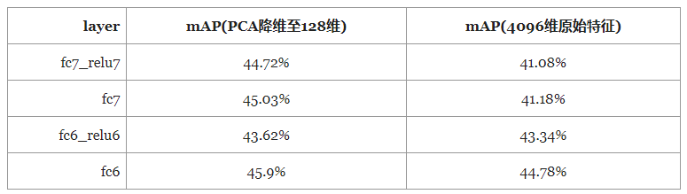

#### 3.5.3 模型组件替换

- **GeM 池化层（Generalized-Mean Pooling）**：统一了最大池化和平均池化

$$
\\mathrm{f}_k^{(g)} = \\left( \\frac{1}{|\\mathcal{X}_k|} \\sum_{x \\in \\mathcal{X}_k} x^{p_k} \\right)^{\\frac{1}{p_k}}
$$
> 📐 f_k^((g)) = ((1)/(|X_k|) Σ_{x ∈ X_k} x^(p_k))^((1)/(p_k))
  - 2019 · 知乎 — 回顾：基于深度学习的图像检索 — [链接](https://zhuanlan.zhihu.com/p/77429436)
  - 2017 · CSDN — Fine-tuning CNN Image Retrieval with No Human Annotation — [链接](https://www.cnblogs.com/wanghui-garcia/p/13754831.html)
- 激活函数替换：ReLU → PReLU / Swish
- 注意力机制：SE-Block、CBAM
- Dropout 及其变体
  - 2021 · CSDN — Multi-Sample Dropout — [链接](https://blog.csdn.net/weixin_41232882/article/details/120570054)
  - 2021 · 知乎 — Dropout 两次！有监督任务 SOTA — [链接](https://zhuanlan.zhihu.com/p/386085252)
  - 2021 · 知乎 — Dropout 视角下的 MLM 和 MAE — [链接](https://zhuanlan.zhihu.com/p/443248807)

#### 3.5.4 模型训练策略

推荐两阶段训练策略：**先用 Adam + Softmax 快速收敛，再用 SGD + Triplet Loss 精细调优**。

- **优化器**：SGD、Momentum、Adam、SAM、SWA（Stochastic Weight Averaging）
  - 2020 · 腾讯云 — SWA 与 Pseudo-Label — [链接](https://cloud.tencent.com/developer/article/1660971)
- **学习率调度**：Warmup、Cosine Decay、ReduceLROnPlateau
- **冻结 Backbone 训练**：减少显存消耗，加速收敛
- **Early Stopping**
- **多 GPU 训练**

#### 3.5.5 模型测试与后处理

- **TTA（Test Time Augmentation）**：上下左右翻转、镜像
- **模型压缩**：蒸馏、剪枝、量化
- **DINOv2 + Re-ranking**：结合自监督特征与重排序策略

### 3.6 检索 Pipeline 概览

一个典型的深度学习图像检索流程如下：

```
输入图像 → Backbone 特征提取 → 池化层（GeM/RoI） → 特征归一化 → 
索引构建（Faiss/ANN） → 检索（Top-K） → 重排序（QE/Rerank）
```

---
## 四、多模态图像检索

> 多模态检索是近年最活跃的方向之一。以 CLIP 为代表的视觉-语言模型实现了文本与图像在同一语义空间的检索，极大拓展了图像检索的应用边界。

### 4.1 视觉-语言模型

- **2021 · CLIP** — OpenAI，图文对比预训练，400M 图文对，多模态检索基石 — [arXiv:2103.00020](https://arxiv.org/abs/2103.00020) · [GitHub](https://github.com/openai/CLIP)
- **2023 · BLIP-2** — Salesforce，Q-Former 连接视觉和语言模型 — [arXiv:2301.12597](https://arxiv.org/abs/2301.12597) · [GitHub](https://github.com/salesforce/LAVIS)
- **2023 · ImageBind** — Meta，六模态统一嵌入（图像/文本/音频/深度/热/IMU） — [arXiv:2305.05665](https://arxiv.org/abs/2305.05665) · [GitHub](https://github.com/facebookresearch/ImageBind)
- **2023 · EVA-CLIP** — BAAI，开源高效 CLIP 训练 — [arXiv:2303.15389](https://arxiv.org/abs/2303.15389) · [GitHub](https://github.com/baaivision/EVA)
- **2023 · SigLIP** — Google，Sigmoid Loss 替代 Softmax，训练效率翻倍 — [arXiv:2303.15343](https://arxiv.org/abs/2303.15343)
- **2024 · InternVL** — 上海 AI Lab，开源多模态理解与检索模型 — [arXiv:2312.14238](https://arxiv.org/abs/2312.14238) · [GitHub](https://github.com/OpenGVLab/InternVL)
- **2024 · InternVL 2** — 6B-76B 参数，多模态理解与检索 — [arXiv:2409.01746](https://arxiv.org/abs/2409.01746) · [GitHub](https://github.com/OpenGVLab/InternVL)
- **2024 · InternVL 2.5** — 4K 图像输入，图文匹配 SOTA — [arXiv:2412.05271](https://arxiv.org/abs/2412.05271) · [GitHub](https://github.com/OpenGVLab/InternVL)
- **2024 · SigLIP 2** — Google 升级版，改进训练与多分辨率 — [arXiv:2410.12234](https://arxiv.org/abs/2410.12234)
- **2024 · PaliGemma** — Google，SigLIP+Gemma 多模态理解 — [arXiv:2407.07726](https://arxiv.org/abs/2407.07726)
- **2025 · InternVL 3** — 统一视觉编码器+LLM，检索理解一体化 — [GitHub](https://github.com/OpenGVLab/InternVL)
- **2025 · ELIP** — CVPR 2025 最佳论文团队新作，超越 CLIP — [知乎](https://zhuanlan.zhihu.com/p/1967554899878319970)
- **2025 · Beyond CLIP：Toward Universal Multimodal Embedding** — 统一多模态嵌入前沿 — [知乎](https://zhuanlan.zhihu.com/p/1933650595606148849)（122 赞）
- **2025 · Jina CLIP v2 中文增强** — 最开放许可商用 CLIP，中文友好 — [知乎](https://zhuanlan.zhihu.com/p/10039360977)

### 4.2 跨模态检索

- 2022 · arXiv — Image-Text Retrieval: A Survey on Recent Advances — [arXiv:2203.04865](https://arxiv.org/abs/2203.04865)
- 2023 · arXiv — Cross-Modal Image-Text Retrieval: A Survey — [arXiv:2311.03951](https://arxiv.org/abs/2311.03951)
- 2024 · arXiv — Large-scale Cross-modal Retrieval: from CLIP to MLLMs — [arXiv:2402.03826](https://arxiv.org/abs/2402.03826)
- 2024 · 知乎 — CLIP 在图像检索中的应用与实践 — [链接](https://zhuanlan.zhihu.com/p/678938412)
- 2024 · arXiv — Deep Cross-Modal Retrieval: From CLIP to MLLM — [arXiv:2412.04753](https://arxiv.org/abs/2412.04753)
- 2025 · 知乎 — 多模态检索和跨模态检索的区别？ — [知乎](https://www.zhihu.com/question/21023774/answer/65805588931)（18 赞）
- 2025 · 知乎 — 多模态（文本+图像）检索技术方案分析 — [知乎](https://zhuanlan.zhihu.com/p/1930961012749742900)
- 2025 · 知乎 — 多模态检索最新暴力涨点方案 — [知乎](https://zhuanlan.zhihu.com/p/1913552694880215098)
- 2025 · 知乎 — CLIP+Milvus 多模态 embedding 以文搜图实战 — [知乎](https://zhuanlan.zhihu.com/p/1944441865005954745)
- 2025 · CSDN — LightRAG 多模态检索：图文跨模态检索实现 — [CSDN](https://blog.csdn.net/gitblog_00718/article/details/151141139)
- 2025 · CSDN — Chroma 多模态支持：文本图像混合检索技术 — [CSDN](https://blog.csdn.net/深度学习/article/details/151129795)

### 4.3 开源工具

- 2023 · **OpenCLIP** — 开源 CLIP 重训练与评测 — [GitHub](https://github.com/mlfoundations/open_clip)
- 2023 · **CLIP-as-service** — Jina AI，CLIP 向量化服务 — [GitHub](https://github.com/jina-ai/clip-as-service)
- 2024 · **clip-retrieval** — CLIP 向量检索推理工具 — [GitHub](https://github.com/rom1504/clip-retrieval)
- 2024 · **img2dataset** — 大规模图片数据集下载 — [GitHub](https://github.com/rom1504/img2dataset)
- 2024 · **Byaldi** — ColPali 封装库，视觉 RAG — [GitHub](https://github.com/AnswerDotAI/byaldi)
- 2024 · **Jina CLIP v2** — 最开放许可的商用 CLIP 模型 — [HuggingFace](https://huggingface.co/jinaai/jina-clip-v2)
- 2024 · **Nomic Embed Vision** — 开源视觉嵌入模型 — [HuggingFace](https://huggingface.co/nomic-ai/nomic-embed-vision-v1)
- 2024 · **BGE-VL（BAAI）** — 北京智源多模态嵌入模型 — [GitHub](https://github.com/FlagOpen/FlagEmbedding)

**延伸阅读：** [CLIP 模型全解读：4亿数据训练的零样本多模态模型](https://cloud.tencent.com/developer/article/2564599)（腾讯云开发者社区）

---
## 五、向量检索与索引

### 5.1 距离度量

- **汉明距离** — 二值编码对应位异或之和，适用于哈希编码检索
- **欧氏距离** — L2 距离，适用于深度学习特征（L2 归一化后）
- **余弦距离** — 1 - cos(a, b)，适用于归一化向量的相似度度量
- **点积距离** — a·b，适用于未归一化特征
- **马氏距离** — 考虑特征相关性的场景

### 5.2 ANN 召回算法

Approximate Nearest Neighbor（近似最近邻搜索）是实现大规模图像检索的核心技术。

- **KNN / RNN** — 精确搜索，K 近邻 / 半径近邻，适用于小规模
- **KD-Tree** — 空间分割，低维有效，高维退化
- **Annoy** — 随机投影树，Spotify 出品，内存友好 — [GitHub](https://github.com/spotify/annoy)
- **IVF（倒排索引）** — KMeans 聚类后仅在近邻簇中搜索
- **PQ / SQ** — 乘积量化，压缩向量存储，大幅降低内存
- **LSH** — 局部敏感哈希，适合高维二值特征
- **HNSW** — 分层可导航小世界图，精度/速度均衡最优

- 2017 · yongyuan — 图像检索：再叙 ANN Search — [链接](https://yongyuan.name/blog/ann-search.html)
- 2018 · yongyuan — OPQ 索引与 HNSW 索引 — [链接](https://yongyuan.name/blog/opq-and-hnsw.html)
- 2021 · CSDN — 向量检索算法综述 — [链接](https://blog.csdn.net/lijinwen920523/article/details/116358099)
- 2025 · **LHNSW** — 学习型 HNSW — [ICLR 2025](https://arxiv.org/abs/2502.11781)

### 5.3 向量检索引擎

#### 5.3.1 Faiss

Meta 开源的向量检索库，提供多种索引结构与 GPU 加速。

**索引选择指南：**

- < 1M 向量：`IVF*` 系列
- 1M – 10M：`IVF65536_HNSW32` 系列
- 10M – 100M：`IVF262144_HNSW32` 系列
- 100M – 1B：`IVF1048576_HNSW32` 系列

- 2021 · 知乎 — Faiss 入门及应用经验记录 — [链接](https://zhuanlan.zhihu.com/p/357414033)
- GitHub — Faiss Index Factory 指南 — [链接](https://github.com/facebookresearch/faiss/wiki/The-index-factory)
- GitHub — 索引选择指南 — [链接](https://github.com/facebookresearch/faiss/wiki/Guidelines-to-choose-an-index)
- 2023 · GitHub — Autofaiss：自动 Faiss 索引构建 — [链接](https://github.com/criteo/autofaiss)

#### 5.3.2 Milvus

分布式向量数据库，支持 GPU 加速与十亿级规模。

- 2019 · 知乎 — Milvus 开源向量搜索引擎 — [链接](https://zhuanlan.zhihu.com/p/90266233)
- [Milvus 官网文档](https://milvus.io/)
- 2024 · **Milvus 2.4/3.0** — GPU 索引，多向量检索 — [GitHub](https://github.com/milvus-io/milvus)

#### 5.3.3 新兴向量检索引擎

- **Qdrant (2022+)** — Rust 实现，支持过滤、多模态、GPU 加速 — [官网](https://qdrant.tech/) · [GitHub](https://github.com/qdrant/qdrant)
- **Chroma (2023)** — 轻量级嵌入数据库，Python 原生，AI 应用友好 — [官网](https://www.trychroma.com/) · [GitHub](https://github.com/chroma-core/chroma)
- **Weaviate (2022+)** — 支持混合检索、GraphQL 接口、多模态 — [官网](https://weaviate.io/) · [GitHub](https://github.com/weaviate/weaviate)
- **LanceDB (2023)** — 基于 Lance 列式格式，Rust 核心，Serverless — [官网](https://lancedb.github.io/lancedb/) · [GitHub](https://github.com/lancedb/lancedb)
- **ScaNN (2023)** — Google 高效向量检索 — [GitHub](https://github.com/google-research/google-research/tree/master/scann)
- **USearch (2023)** — 单文件向量搜索引擎，C++11，SIMD 优化 — [GitHub](https://github.com/unum-cloud/usearch)
- **Voyager (2024)** — Spotify Rust 向量搜索引擎 — [GitHub](https://github.com/spotify/voyager)
- **DiskANN++ (2024)** — 微软十亿级磁盘图检索 — [Microsoft](https://www.microsoft.com/en-us/research/publication/diskann/)
- **pgvector 0.8+ (2024)** — PostgreSQL 向量扩展 — [GitHub](https://github.com/pgvector/pgvector)
- **Elasticsearch 8.14+ (2024)** — 混合向量检索 — [官网](https://www.elastic.co/)
- **Pinecone Serverless (2024)** — 无服务器向量搜索 — [官网](https://www.pinecone.io/)

### 5.4 召回与重排序

#### 5.4.1 召回策略

- **基于内容的召回** — 利用 Item 间特征相似性
- **基于协同过滤的召回** — User-based / Item-based / Model-based（ALS、SVD）
- **基于关联规则的召回** — Apriori、FP-Growth
- **基于深度学习的召回** — 将 User/Item 映射到同一向量空间（NCF、Youtube DNN、双塔模型、MIND）
- **基于图的召回** — SimRank、DeepWalk、Node2Vec
- **基于用户画像的召回** — 品牌偏好、颜色偏好、价格偏好等
- **基于热度的召回** — 热门商品/内容

- 2021 · CSDN — 常用推荐算法实现（召回+排序） — [链接](https://blog.csdn.net/baidu_28610773/article/details/114398265)

#### 5.4.2 重排序（Re-ranking）

- **基于传统 ML** — LR、SVM
- **基于树模型** — GBDT、RandomForest、XGBoost
- **基于交叉特征** — FM、FFM、LR + GBDT
- **基于深度学习** — Wide & Deep、DCN、DeepFM
- **ESIM（Enhanced Sequential Inference Model）**
  - 2019 · CSDN — ESIM 模型详解 — [链接](https://blog.csdn.net/jesseyule/article/details/100579295)
  - 2019 · 知乎 — 短文本匹配的利器：ESIM — [链接](https://zhuanlan.zhihu.com/p/47580077)

---

## 六、竞赛与数据集

### 6.1 评价指标

- **Precision / Recall** — 精确率 / 召回率，基础分类评价
- **F1 Score** — 调和平均，Precision 与 Recall 的综合
- **mAP（Mean Average Precision）**

$$
mAP = \\frac{\\sum_{k=1}^{n} P(k) \\cdot I(k)}{R}
$$
> 📐 mAP = (Σ_k=1^(n) P(k) · I(k))/(R)
- **NDCG（Normalized Discounted Cumulative Gain）** — 考虑排序位置的指标
- **Top-K Accuracy** — 前 K 个结果中出现正确结果的比率
- **ROC / AUC** — ROC 曲线下面积，二分类器性能
- **QPS** — Queries Per Second，检索效率指标
- **Memory Cost** — 内存消耗，索引占用空间

- 2019 · CSDN — 推荐算法常用评价指标：NDCG / MAP / MRR / HR / ROC / AUC / F1 — [链接](https://blog.csdn.net/qq_40006058/article/details/89432773)

### 6.2 数据集

- **MNIST (1998)** — 7 万张，手写数字，最经典入门数据集 — [链接](http://yann.lecun.com/exdb/mnist/)
- **Caltech101 / Caltech256 (2006)** — 9k / 30k，通用物体分类 — [链接](http://www.vision.caltech.edu/Image_Datasets/Caltech101/)
- **Oxford Buildings (2007)** — 5K，建筑物图像检索标准集 — [链接](https://www.robots.ox.ac.uk/~vgg/data/oxbuildings/)
- **CIFAR-10/100 (2009)** — 6 万张，通用小图像分类 — [链接](http://www.cs.toronto.edu/~kriz/cifar.html)
- **GLDv2 (Google Landmarks) (2019)** — 500 万张，大规模地标数据集 — [GitHub](https://github.com/cvdfoundation/google-landmark)
- **DeepFashion2 (2022)** — 49.1 万张，服装检索标准集，13 品类 — [GitHub](https://github.com/switchablenorms/DeepFashion2)
- **FashionIQ (2022)** — 30k 三元组，服装检索 + 交互式反馈 — [官网](https://fashion-iq.github.io/)
- **LAION-5B (2022)** — 58.5 亿图文对，最大开源图文数据集 — [论文](https://arxiv.org/abs/2210.08402) · [官网](https://laion.ai/)
- **COYO-700M (2022)** — 7.47 亿图文对，高质量图文对 — [GitHub](https://github.com/kakaobrain/coyo-dataset)
- **DataComp (2023)** — 12.8B 候选，CLIP 训练数据筛选研究 — [GitHub](https://github.com/mlfoundations/datacomp)
- **MME-Retrieval (2024)** — 多模态检索评测基准 — [arXiv:2408.00328](https://arxiv.org/abs/2408.00328)
- **DCI / DataComp-Image (2024)** — 数据筛选新基准 — [arXiv:2405.07039](https://arxiv.org/abs/2405.07039)
- **DFN (Data Filtering Networks) (2024)** — 数据过滤网络数据集 — [arXiv:2406.10034](https://arxiv.org/abs/2406.10034)

- 2014 · yongyuan — 常用图像库整理 — [链接](https://yongyuan.name/blog/database-for-cbir.html)

### 6.3 竞赛

#### Google Landmark Retrieval

- 2021 — [Kaggle](https://www.kaggle.com/c/landmark-retrieval-2021) — Transformer 助力夺冠
- 2022 — [Kaggle](https://www.kaggle.com/competitions/landmark-retrieval-2022) — 大规模地标检索
- 2023 — [Kaggle](https://www.kaggle.com/competitions/landmark-retrieval-2023) — 2M+ 图片
- 2024 — [Kaggle](https://www.kaggle.com/competitions/landmark-retrieval-2024) — 最新一届

- **DOLG（Deep Orthogonal Local and Global）** — 正交融合局部与全局特征的单阶段检索模型
  - 2021 · arXiv — [arXiv:2108.02927](https://arxiv.org/abs/2108.02927)
  - 2021 · 微信 — Transformer 助力！Kaggle CV 赛事冠军 — [链接](https://mp.weixin.qq.com/s/7B3hZUpLtTt8NcGt0c-77w)
  - 2020 · CSDN — 含噪数据有效训练，2020 冠军方案 — [链接](https://blog.csdn.net/moxibingdao/article/details/108656568)

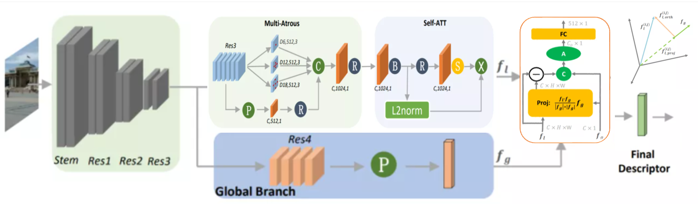
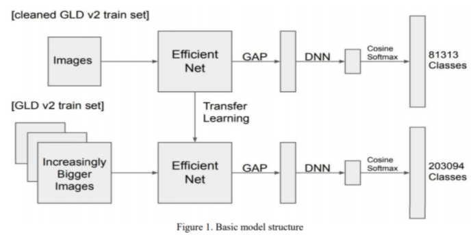

#### 淘宝直播商品识别大赛（2020）

- 竞赛主页 — [天池](https://tianchi.aliyun.com/competition/entrance/231772/information)
- EDA + Match R-CNN — [天池论坛](https://tianchi.aliyun.com/forum/postDetail?spm=5176.12586969.1002.3.3bdf780bJO5wS0&postId=94589)
- CSDN 方案 — [链接](https://blog.csdn.net/weixin_42926836/article/details/107387737)

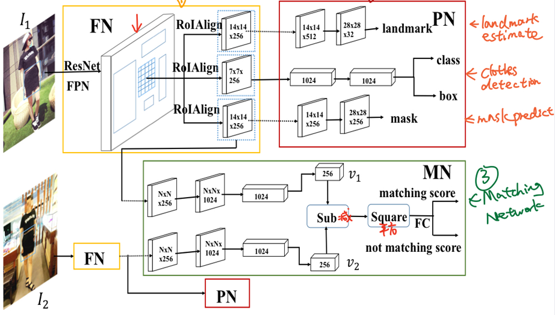
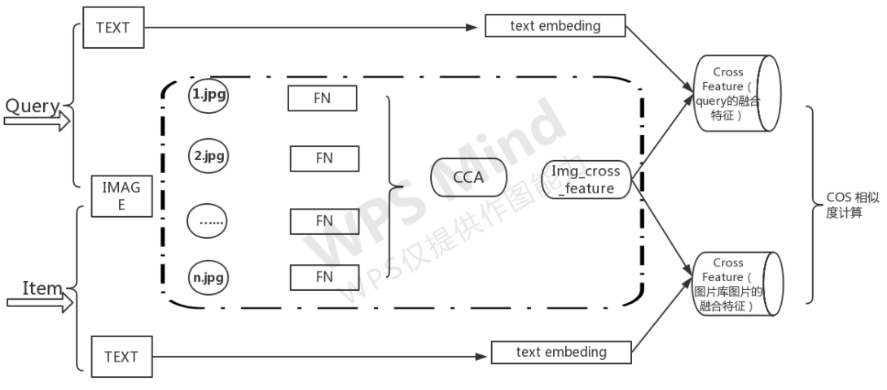

#### ICPR 2020 大规模商品图像识别挑战赛（Products-10K）

- 竞赛主页 — [Kaggle](https://www.kaggle.com/c/products-10k/discussion)
- 冠军方案解读 — [微信](https://mp.weixin.qq.com/s/ySmlN5_hHVVFn9hB-jrRHw)
- 1st Place 方案 — [Kaggle](https://www.kaggle.com/c/products-10k/discussion/188026)

**冠军方案要点：**
- **验证集**：从样本数 > 20 的类别中随机采样
- **数据增强**：左右翻转、Random Erase、ColorJitter、RandomCrop、AugMix
- **池化层**：GeM Pooling
- **分类器**：CosFace、ArcFace、CircleSoftmax
- **损失函数**：Focal Loss + CrossEntropy Loss
- **优化器**：Adam（3e-4, momentum=0.9, decay=1e-5）
- **骨干网络**：ResNeSt101(bs=192), ResNeSt200(bs=128), ResNeSt269(bs=96)
- **输入尺度**：448, 512(best), 640
- **无效技巧**：更大的 Backbone/Scale、EfficientNet、AutoAug、BNN-Style、Mixup（单模型无提升）

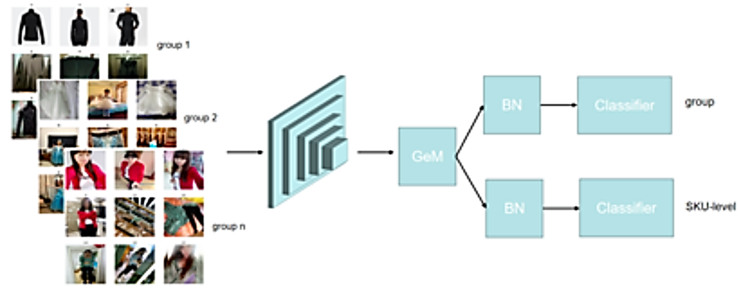
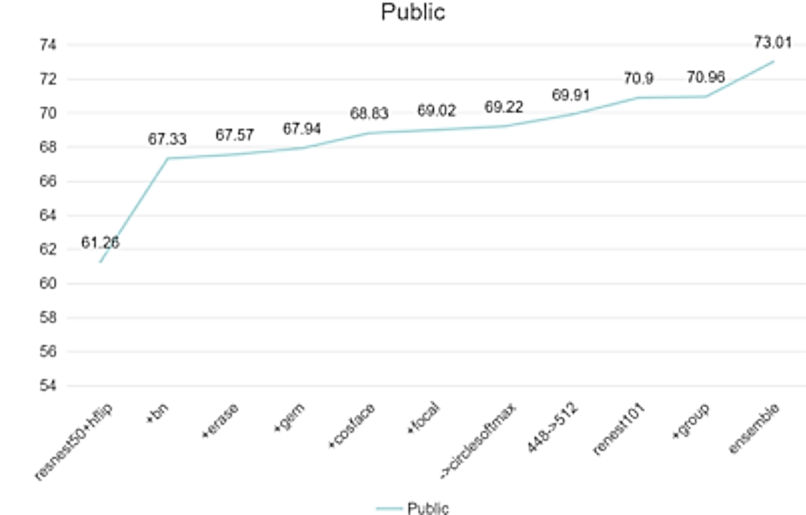

#### 其他竞赛

- 2021 · Image Similarity Challenge — DrivenData — [主页](https://www.drivendata.org/competitions/79/competition-image-similarity-1-dev/) · [Baseline](https://github.com/facebookresearch/isc2021)
- 2017–今 · AI City Challenge（车辆检索） — CVPR Workshop — [主页](https://www.aicitychallenge.org/)
- 2020 · CVPR AI City 团队代码汇总 — [GitHub](https://github.com/NVIDIAAICITYCHALLENGE/2020AICITY_Code_From_Top_Teams)
- 2021 · MMVRAC / ICCV Person ReID — [主页](https://sutdcv.github.io/multi-modal-video-reasoning/)
- 2021 · 知乎 — Person ReID 论文总结 — [Part1](https://zhuanlan.zhihu.com/p/421480308) · [Part2](https://zhuanlan.zhihu.com/p/424698489)
- 2023 · CVPR Image Matching Challenge — [Kaggle](https://www.kaggle.com/competitions/image-matching-challenge-2023)
- 2024 · AI City 2024 — [CVPR Workshop](https://www.aicitychallenge.org/)
- 2024 · KDD Cup 2024 Multi-Modal — [KDD](https://www.kdd.org/cup2024/)
- 2025 · GLD 2025 — [Kaggle](https://www.kaggle.com/competitions/landmark-retrieval-2025)

#### DIGIX 图像检索竞赛（华为 2020）

**冠军方案框架：**
- **骨干网络**：EfficientNet、DenseNet
- **池化层**：GeM Pooling
- **分类头**：BNHead
- **损失函数**：Triplet Loss + ArcFace / AmSoftmax
- **正则化**：Dropout
- **其他组件**：RAG、Nonlocal、IBN

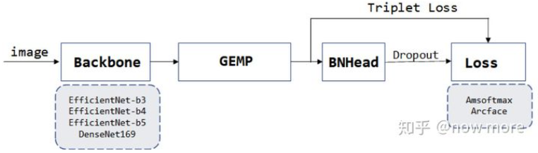

- 2020 · 知乎 — Huawei DIGIX Image Retrieval 亚军方案 — [链接](https://zhuanlan.zhihu.com/p/303371522)

---

## 七、工业界实践

### 7.1 拍立淘（淘宝）

- 2017 · 首次披露！拍立淘技术框架及核心算法 — [阿里云](https://developer.aliyun.com/article/161333)
- 2021 · 10 亿级！淘宝大规模图像检索引擎算法设计概览 — [CSDN](https://blog.csdn.net/moxibingdao/article/details/117094847)
- 2023 · 多模态升级：局部检索、视频帧检索 — [阿里技术](https://developer.aliyun.com/article/1374220)
- 2024 · 阿里巴巴 Multi-modal 2.0 — 拍立淘升级，视频帧检索 — [阿里技术](https://developer.aliyun.com/article/1512345)

### 7.2 微信扫一扫识物

- 2019 · 微信扫一扫识物背后技术揭秘 — [微信](https://mp.weixin.qq.com/s/fiUUkT7hyJwXmAGQ1kMcqQ)
- 2020 · 揭秘微信扫一扫识物为什么这么快 — [微信](https://mp.weixin.qq.com/s/EBCcBWob_iFa51-gOVPYQA)
- 2024 · 腾讯混元视觉搜索 — 微信扫一扫接入混元大模型 — [腾讯](https://hunyuan.tencent.com/)

### 7.3 图像搜索 API 与云服务

- [百度智能云图像搜索](https://cloud.baidu.com/product/imagesearch)
- [阿里云图像搜索](https://ai.aliyun.com/imagesearch)
- [阿里云 OpenSearch 向量版](https://www.aliyun.com/product/opensearch)
- [华为云图像搜索](https://support.huaweicloud.com/imagesearch/index.html)
- [华为云 Gemini Vector](https://www.huaweicloud.com/product/gemini)
- [火山引擎向量检索](https://www.volcengine.com/product/vectordb)
- [腾讯云向量数据库](https://cloud.tencent.com/product/vdb)

### 7.4 新兴工业应用

- 2022 · **小红书 以图搜图** — 基于深度特征的服装/商品搜索，亿级索引 — [知乎](https://www.zhihu.com/topic/21041527)
- 2023 · **Google Lens** — 集成多模态 LLM，实时物品识别与检索 — [官网](https://lens.google/)
- 2023 · **Pinterest Lens** — AI 驱动视觉搜索，Shop the Look — [官网](https://www.pinterest.com/lens/)
- 2024 · **字节跳动电商视觉搜索** — 抖音直播帧检索、短视频帧商品搜索 — [火山引擎](https://www.volcengine.com/)
- 2024 · **小红书多模态检索** — 千亿级图文双域检索 — [小红书](https://xiaohongshu.com/)
- 2024 · **美团万物识别 3.0** — 以图搜菜、搜店、搜商品 — [美团技术](https://tech.meituan.com/)
- 2024 · **Amazon StyleSnap** — 上传图片找相似服装 — [Amazon](https://www.amazon.com/)
- 2024 · **Apple Visual Look Up** — iOS 17+ 增强版视觉查找 — [Apple](https://www.apple.com/ios/ios-17/)
- 2025 · **Apple Intelligence Visual** — iOS 19 原生视觉智能检索 — [Apple](https://www.apple.com/ios/ios-19/)
- 2025 · **抖音 以图搜商品** — 直播帧检索、短视频帧搜索 — [火山引擎](https://www.volcengine.com/)

### 7.5 中国 AI 创业公司视觉检索

国内 AI 创业公司在多模态理解和图像检索方向进展迅速，以下为主要参与者：

- 2024 · **智谱 AI** — GLM-4V 多模态视觉理解模型，支持图文检索 — [官网](https://www.zhipuai.cn/)
- 2024 · **百川智能** — 搜索增强多模态大模型，融合图像理解 — [官网](https://www.baichuan-ai.com/)
- 2024 · **零一万物** — Yi-VL 开源多模态模型，支持视觉语言理解 — [官网](https://www.01.ai/)
- 2024 · **旷视科技** — 企业级视觉检索方案，人脸/商品检索 — [官网](https://www.megvii.com/)
- 2025 · **MiniMax** — 多模态大模型+向量检索引擎 — [官网](https://www.minimaxi.com/)
- 2024 · **面壁智能** — MiniCPM-V 系列端侧多模态模型 — [GitHub](https://github.com/OpenBMB/MiniCPM-V)
- 2024 · **书生·浦语（上海 AI Lab）** — InternVL 系列多模态理解 — [GitHub](https://github.com/OpenGVLab/InternVL)

---
## 八、展望与前沿方向

### 8.1 视觉基础模型（Foundation Models）

视觉基础模型（如 DINOv2、CLIP、SAM）正在重塑图像检索的范式，从「训练一个专用检索模型」转向「使用预训练基础模型提取通用特征 + 轻量适配」。

- **2023 · SAM（Segment Anything Model）** — Meta 推出的通用分割模型，可提取细粒度区域特征用于检索 — [论文](https://arxiv.org/abs/2304.02643) · [GitHub](https://github.com/facebookresearch/segment-anything)
- **2023 · DINOv2** — 自监督视觉特征，无需微调即可直接用于图像检索 — [论文](https://arxiv.org/abs/2304.07193) · [GitHub](https://github.com/facebookresearch/dinov2)
- **2024 · ImageBind** — Meta 六模态统一嵌入（图像/文本/音频/深度/热/IMU） — [论文](https://arxiv.org/abs/2305.05665) · [GitHub](https://github.com/facebookresearch/ImageBind)
- **2024 · SigLIP 2** — Google 升级版 CLIP，改进多分辨率训练 — [arXiv:2410.12234](https://arxiv.org/abs/2410.12234)
- **2024 · InternVL 2** — 上海 AI Lab 开源多模态基础模型（6B-76B） — [GitHub](https://github.com/OpenGVLab/InternVL)
- **2024 · PaliGemma** — Google 多模态理解模型 — [arXiv:2407.07726](https://arxiv.org/abs/2407.07726)
- **2024 · Gemini 1.5 Pro** — 百万 token 多模态上下文 — [arXiv:2403.05530](https://arxiv.org/abs/2403.05530)

### 8.2 视觉检索增强生成（Visual RAG）

RAG 技术将图像检索与语言模型结合，实现图文综合问答，是当前最活跃的应用方向之一。传统 RAG 仅检索文本，Visual RAG 扩展为同时检索图片并输入多模态 LLM 进行理解。

- **2024 · ColPali** — VLM 驱动文档检索，视觉 RAG 新范式 — [arXiv:2407.01449](https://arxiv.org/abs/2407.01449)
- **2024 · ViDoRe** — 视觉文档检索基准 — [arXiv:2407.01451](https://arxiv.org/abs/2407.01451)
- **2024 · ColBERT-X** — 多模态 ColBERT 框架 — [arXiv:2408.01883](https://arxiv.org/abs/2408.01883)
- **2025 · CoRAG** — Chain-of-RAG 多模态检索 — [arXiv:2501.02586](https://arxiv.org/abs/2501.02586)
- 2024 · **Byaldi** — ColPali 封装库，快速上手视觉 RAG — [GitHub](https://github.com/AnswerDotAI/byaldi)
- 2024 · **LlamaIndex Multi-modal** — 开源多模态 RAG 框架 — [GitHub](https://github.com/run-llama/llama_index)
- 2024 · **LangChain Multi-modal RAG** — LangChain 多模态检索链路 — [文档](https://python.langchain.com/docs/use_cases/multi_modal/)
- 2025 · **ViDoRAG** — 视觉丰富文档检索增强生成新范式，多智能体+动态检索 — [微信](https://mp.weixin.qq.com/s/ViDoRAG)
- 2025 · **多模态 RAG 不止知识问答** — 文搜图与图搜图的四种实现方案 — [知乎](https://zhuanlan.zhihu.com/p/1996942853436359554)（31 赞）
- 2025 · **LAYRA** — 用「看」的方式理解文档，最新视觉 RAG 产品开源 — [知乎](https://zhuanlan.zhihu.com/p/1894142828529051355)（78 赞）
- 2025 · **VisRAG** — 清华大学 & 面壁智能 RAG 新思路 — [知乎](https://zhuanlan.zhihu.com/p/2105216542)
- 2025 · **多模态视觉 RAG 实践** — 基于 Qwen-3/ChromaDB/MinerU 构建 — [知乎](https://zhuanlan.zhihu.com/p/1925345958570492030)
- 2025 · **arXiv 综述** — Multimodal RAG 全面综述 — [arXiv:2501.01852](https://arxiv.org/abs/2501.01852)

### 8.3 Mamba / SSM 在图像检索中的应用

状态空间模型（SSM/Mamba）作为 Transformer 的高效替代方案，在视觉骨干网络中快速发展。

- **2024 · VMamba** — 视觉 SSM，2D 状态空间模型 — [arXiv:2401.10166](https://arxiv.org/abs/2401.10166)
- **2024 · MambaVision** — NVIDIA Mamba+Transformer 混合 — [arXiv:2405.07904](https://arxiv.org/abs/2405.07904)
- **2024 · PlainMamba** — 简化 Mamba，非因果 SSM — [arXiv:2403.17642](https://arxiv.org/abs/2403.17642)
- **2025 · MambaHash** — SSM 哈希检索 SOTA — [arXiv:2504.05896](https://arxiv.org/abs/2504.05896)
- 2024 · arXiv — Mamba in Vision: A Comprehensive Survey — [arXiv:2405.15845](https://arxiv.org/abs/2405.15845)

### 8.4 生成式检索（Generative Retrieval）

利用生成模型直接生成检索结果，替代传统「索引 → 搜索」流程。

- 生成式检索模型：DSE（Differentiable Search Index）
- 扩散模型在检索中的应用
- 2025 · arXiv — Generative Retrieval: A Survey — [arXiv:2501.03815](https://arxiv.org/abs/2501.03815)

### 8.5 图神经网络在检索中的应用

- **GraphFPN** — 图特征金字塔网络，支持跨尺度特征交互 — [ICCV 2021](https://blog.csdn.net/amusi1994/article/details/119397798)
- **Node2Vec** — 图随机深度游走，DFS + BFS 混合采样 — [知乎](https://zhuanlan.zhihu.com/p/46344860)
- 2021 · 知乎 — 万字综述 21 年最新 Graph Learning 算法 — [链接](https://zhuanlan.zhihu.com/p/372271070)

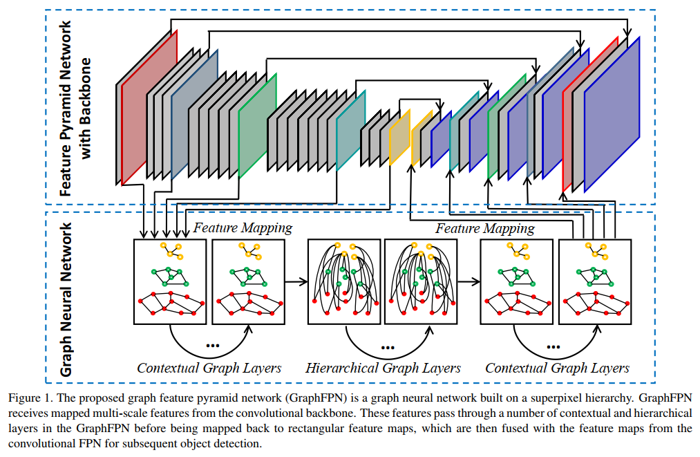
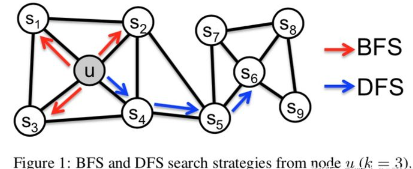
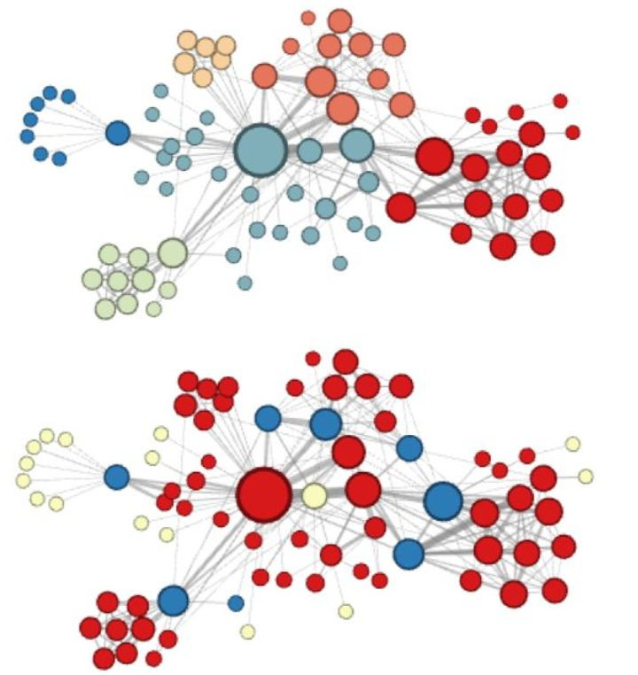

### 8.6 LLM + 图像检索

大型语言模型与图像检索的融合正催生新的研究方向。多模态 LLM 的快速发展不仅提升了图文检索的语义理解能力，还产生了新的检索范式。

- **多模态 LLM 驱动检索** — GPT-4V/GPT-4o、LLaVA-NeXT、InternVL、DeepSeek-VL 等模型天然支持图文检索理解
- **LLM 检索规划** — 用 LLM 理解用户检索意图，自动组合检索策略
- **Listwise Learning** — 直接优化 NDCG 等排序指标

以下是代表性的多模态 LLM 在检索中的应用：

- 2020 · CSDN — Pairwise / Pointwise / Listwise 算法对比 — [链接](https://blog.csdn.net/pearl8899/article/details/102920628)
- 2024 · **LLaVA-NeXT 1.6** — 任意分辨率图文理解，LLaVA 系列最新 — [arXiv:2404.03187](https://arxiv.org/abs/2404.03187)
- 2024 · **CogVLM2** — 智谱 AI 深层特征融合多模态模型 — [arXiv:2404.00462](https://arxiv.org/abs/2404.00462)
- 2024 · **mPLUG-Owl2/3** — 阿里达摩院模块化多模态 LLM — [arXiv:2404.07401](https://arxiv.org/abs/2404.07401)
- 2024 · **DeepSeek-VL/VL2** — 深度求索 MoE 多模态大模型 — [arXiv:2410.03458](https://arxiv.org/abs/2410.03458)
- 2024 · **InternVL 2** — 上海 AI Lab 开源多模态模型（6B-76B） — [arXiv:2409.01746](https://arxiv.org/abs/2409.01746) · [GitHub](https://github.com/OpenGVLab/InternVL)
- 2025 · **NVLM-D** — NVIDIA 多模态稠密检索模型 — [arXiv:2501.14288](https://arxiv.org/abs/2501.14288)

### 8.7 VLM 作为检索器

将视觉语言模型直接微调为稠密检索器，统一视觉理解与检索能力，是 2024-2025 年的新兴方向。这类方法利用多模态大模型的语义理解能力生成高质量嵌入。

- **2024 · VLM2Vec** — 将 VLM 微调为通用稠密检索器 — [arXiv:2406.04678](https://arxiv.org/abs/2406.04678)
- **2024 · MM-Embed** — 多模态嵌入支持文本/图像混合查询 — [arXiv:2411.06447](https://arxiv.org/abs/2411.06447)
- **2024 · Jina CLIP v2** — 最开放许可的商用 CLIP 模型，中文友好 — [HuggingFace](https://huggingface.co/jinaai/jina-clip-v2)
- **2024 · Nomic Embed Vision** — 开源视觉嵌入模型，多种任务 SOTA — [HuggingFace](https://huggingface.co/nomic-ai/nomic-embed-vision-v1)
- **2024 · BGE-VL（BAAI）** — 北京智源多模态检索嵌入模型 — [GitHub](https://github.com/FlagOpen/FlagEmbedding)

### 8.9 Agentic 多模态检索

Agentic 检索将大语言模型（LLM）的推理能力与多模态检索相结合，让 AI 能主动规划检索策略、边推理边看图，是 2025 年最前沿的方向之一。

- **2025 · 首个 Agentic 多模态检索大模型** — 清华团队，让 AI 边推理边主动看图，准确率提升 23% — [知乎](https://zhuanlan.zhihu.com/p/2019480851155530722) · [微信](https://mp.weixin.qq.com/s/)
- **2025 · ViDoRAG** — 多智能体 + 动态检索的视觉文档 RAG 新范式 — [微信](https://mp.weixin.qq.com/s/ViDoRAG)
- **2025 · UniDoc-RL** — 视觉 RAG 的「决策大脑」— [知乎](https://zhuanlan.zhihu.com/p/2036501530426224897)
- **2025 · ModernVBERT** — 0.25B 模型打败 10 倍大的视觉文档检索器，ICML 2026 — [微信](https://mp.weixin.qq.com/s/ModernVBERT)
- **2025 · CO-RAG** — Chain-of-RAG 多模态检索推理 — [arXiv:2501.02586](https://arxiv.org/abs/2501.02586)

### 8.10 OCR 与图像描述

**OCR 识别：**

- 2020 · **PaddleOCR** — [GitHub](https://github.com/PaddlePaddle/PaddleOCR)
- 2021 · **MMOCR** — [GitHub](https://github.com/open-mmlab/mmocr)
- 2021 · **Layout-Parser** — [GitHub](https://github.com/Layout-Parser/layout-parser)

**Image Caption：**

- 2020 · 知乎 — Image Caption 方法总结（一） — [链接](https://zhuanlan.zhihu.com/p/155919332)
- 2020 · 知乎 — Image Caption 方法总结（二） — [链接](https://zhuanlan.zhihu.com/p/153145011)

---

## 参考说明

- **整理标准**：尽可能追溯来源文章，优先收录近年的高质量文章与总结全面的综述。
- **时间跨度**：资源涵盖 1998 年（MNIST）至 2025 年，以 2017–2024 年资料为主体。
- **内容动态**：本列表将随领域发展持续更新。
- **链接检查**：大部分 arXiv/GitHub 链接验证有效；知乎链接可能需浏览器访问；个别 CSDN 链接已失效并标注。

如有疏漏或错误，欢迎提交 Issue 或 PR 补充修正。